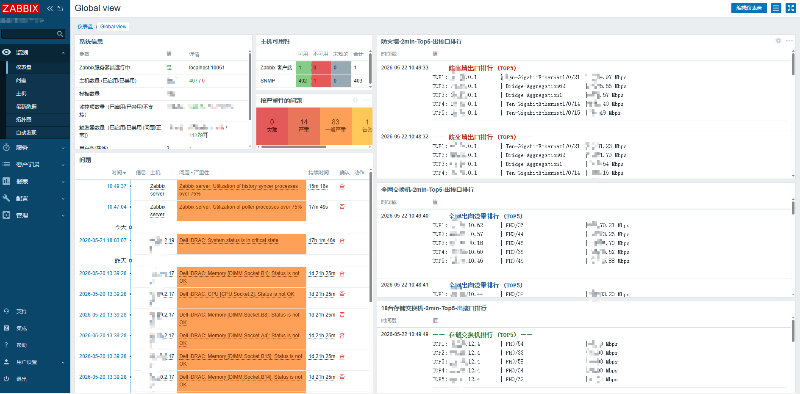

# Zabbix Top5 流量 Widget 配置



> 通过 Zabbix HTTP 代理监控项主动拉取 VictoriaMetrics 数据，JavaScript 预处理格式化输出，  
> 在 Global View 仪表盘展示存储交换机 Top5 出口流量实时排行。

---

## 方案说明

| 步骤 | 类型 | 作用 |
|------|------|------|
| 监控项①：JSON Source | HTTP 代理 | 主动拉取 VictoriaMetrics PromQL 查询结果（原始 JSON） |
| 监控项②：Final Display | 相关项目 | 依赖①的结果，JavaScript 预处理格式化为可读的 HTML 排行展示 |

---

## 监控项① —— 主动拉取数据（JSON Source）

| 字段 | 值 |
|------|----|
| 名称 | `ALL-Storage-switch Top 5 JSON Source` |
| 类型 | HTTP 代理 |
| 键值 | `all-storage-switch.top5.json` |
| 信息类型 | 文本 |
| URL | `http://127.0.0.1:8428/api/v1/query` |
| 请求类型 | GET |
| 超时 | 3s |

**查询字段（query 参数）：**

```promql
topk(5, rate(interface_traffic_ifHCOutOctets{device_role="storage_sw", ifName=~"(Ten-Gigabit|HundredGigE|Bridge-Aggregation|FH|Eth-Trunk|GigabitEthernet|XGE|Port-channel).*"}[2m]) * 8 / 1000 / 1000)
```

---

## 监控项② —— 关联展示数据（Final Display）

| 字段 | 值 |
|------|----|
| 名称 | `ALL-Storage-switch Top 5 Final Display` |
| 类型 | 相关项目 |
| 键值 | `all-storage-switch.top5.final.display` |
| 信息类型 | 文本 |
| 主要项 | `Top_Traffic_Storage_Switch: ALL-Storage-switch Top 5 JSON Source` |
| 预处理方式 | JavaScript |

**JavaScript 预处理脚本：**

```javascript
var data = JSON.parse(value);
var results = data.data.result;

// 样式设置：14px 字体，加粗对齐，底部带灰色分割线
var output = "<div style='font-family:monospace; text-align:left; line-height:1.5; font-size:14px; margin-bottom:15px; border-bottom:1px solid #eee; padding-bottom:8px;'>";

// 标题颜色：深绿色，与防火墙（红）、全网（蓝）区分
output += "<b style='color:#2d7d32;'>—— 存储交换机排行 (TOP5) ——</b><br>";

if (results && results.length > 0) {
    for (var i = 0; i < results.length && i < 5; i++) {
        var ip     = results[i].metric.agent_host || "N/A";
        var ifName = results[i].metric.ifName     || "N/A";
        var val    = parseFloat(results[i].value[1]).toFixed(2);

        // 固定宽度对齐：IP 110px，接口名 180px
        var ipSpan = "<span style='display:inline-block; width:110px;'>" + ip     + "</span>";
        var ifSpan = "<span style='display:inline-block; width:180px;'>" + ifName + "</span>";

        output += "TOP" + (i + 1) + ": " + ipSpan + " | " + ifSpan + " | " + val + " Mbps<br>";
    }
} else {
    output += "暂无存储数据<br>";
}

output += "</div>";
return output;
```

---

## 备注

- `device_role="storage_sw"` 标签在 Telegraf 采集配置中定义，用于区分设备角色
- `ifName` 正则覆盖主流厂商接口命名（华为 / H3C / Cisco 等）
- 存储交换机当前暂时下线，数据采集配置保留，后续换新设备后直接复用
- 标题配色规则：防火墙红色、全网蓝色、存储绿色，三类设备在 Global View 中视觉区分明确
