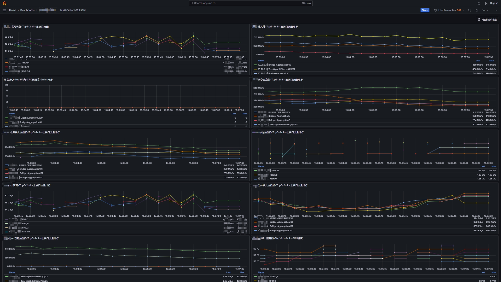

# ai-datacenter-ops

AI 数据中心运维实践 | Telegraf + VictoriaMetrics + Grafana 监控 X 台 GPU 服务器及全网设备

---

## 项目背景

本仓库记录在 **AI 推理数据中心**场景下，从零搭建统一监控平台的完整实践。

环境规模：

- GPU 服务器：**X 台** Dell XE9680（每台 8 卡 H200），共 **X 张 H200 GPU**
- 网络设备：防火墙 × X、核心交换机 × X、存储交换机 × N、业务接入交换机 × N、计算网交换机 × N、OOB 带外交换机 × N
- 监控栈：Telegraf → VictoriaMetrics → Grafana

---

## 仓库结构

```
ai-datacenter-ops/
├── README.md                                    # 项目总览
└── 01-monitoring/                               # 监控模块
    ├── README.md                                # 监控模块说明
    ├── telegraf/
    │   └── telegraf.conf                        # Telegraf 采集配置（脱敏版）
    ├── victoriametrics/
    │   └── vmconfig.yml                         # VictoriaMetrics 服务配置
    └── grafana/
        ├── README.md                            # Grafana 部署说明
        ├── docs/
        │   └── grafana-network-traffic.png      # Dashboard 截图（已打码）
        └── dashboards/                          # 面板 JSON，可直接导入 Grafana
            ├── all-devices-top5-out.json        # 全网设备-Top5-出接口流量
            ├── firewall-top5-out.json           # 防火墙-Top5-出接口流量
            ├── core-sw-top5-out.json            # 核心交换机-Top5-出接口流量
            ├── biz-access-sw-top5-out.json      # 业务接入交换机-Top5-出接口流量
            ├── storage-sw-top5-out.json         # 存储交换机-Top5-出接口流量
            ├── compute-sw-top5-out.json         # 计算网交换机-Top5-出接口流量
            ├── oob-access-sw-top5-out.json      # 带外接入交换机-Top5-出接口流量
            ├── oob-agg-sw-top5-out.json         # 带外汇聚交换机-Top5-出接口流量
            ├── network-crc-error-top5.json      # 全网设备-Top5-双向CRC误码率
            └── gpu-server-top10-temp.json       # GPU服务器-Top10卡-GPU温度
```


---

## 监控架构

```
网络设备 / iDRAC
   │  SNMP
   ▼
Telegraf（采集层）
   │  Prometheus Remote Write
   ▼
VictoriaMetrics（存储层，:8428）
   │  PromQL
   ▼
Grafana（展示层）
```

**选型说明：**

- **Telegraf**：SNMP 插件原生支持，配置简单，多设备角色用 `[inputs.snmp.tags]` 区分，Grafana 里可直接按 `device_role` 过滤
- **VictoriaMetrics**：单机版极简部署，比 Prometheus 更省内存，适合设备多、点位多的 IDC 场景
- **Grafana**：统一展示网络流量 + GPU 温度，同一 Dashboard 通过变量切换设备角色

---

## Grafana Dashboard 预览

> 以下截图已打码处理，隐藏实际 IP 地址及设备数量

**网络流量总览（按设备角色聚合）**



<!-- 后续补充：GPU 温度 Dashboard 截图 -->
<!--  -->

---

## 快速开始

详见 [01-monitoring/README.md](./01-monitoring/README.md)

---

## License

MIT
