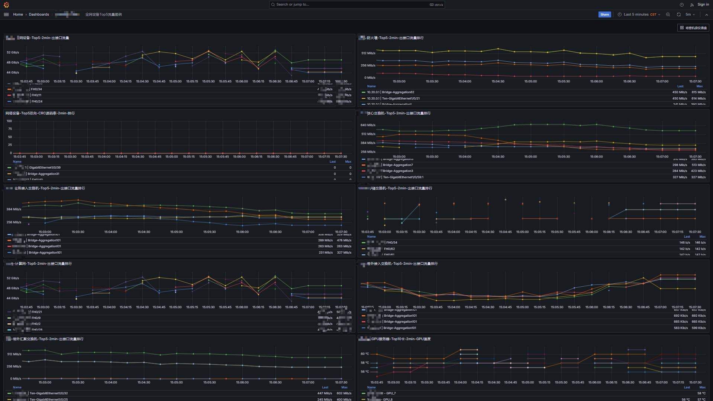

# ai-datacenter-ops

AI 数据中心运维实践 | Telegraf + VictoriaMetrics + Grafana 监控 X 台 GPU 服务器及全网设备

---

## 项目背景

本仓库记录在 **AI 推理数据中心**场景下，从零搭建统一监控平台的完整实践。

环境规模：

- GPU 服务器：**X 台** Dell XE9680（每台 8 卡 H200），共 **X 张 H200 GPU**
- 网络设备：防火墙 × X、核心交换机 × X、存储交换机 × N、业务接入交换机 × N、计算网交换机 × N、OOB 带外交换机 × N
- 监控栈：Telegraf → VictoriaMetrics → Grafana（指标展示）+ Zabbix（实时排行 + 告警）

---

## 仓库结构

```
ai-datacenter-ops/
├── README.md                                    # 项目总览
├── 01-monitoring/                               # Grafana 监控模块
│   ├── README.md                                # 监控模块说明
│   ├── telegraf/
│   │   └── telegraf.conf                        # Telegraf 采集配置（脱敏版）
│   ├── victoriametrics/
│   │   └── vmconfig.yml                         # VictoriaMetrics 服务配置
│   └── grafana/
│       ├── README.md                            # Grafana 部署说明
│       ├── docs/
│       │   └── grafana-network-traffic.png      # Dashboard 截图（已打码）
│       └── dashboards/                          # 面板 JSON，可直接导入 Grafana
│           ├── all-devices-top5-out.json        # 全网设备-Top5-出接口流量
│           ├── firewall-top5-out.json           # 防火墙-Top5-出接口流量
│           ├── core-sw-top5-out.json            # 核心交换机-Top5-出接口流量
│           ├── biz-access-sw-top5-out.json      # 业务接入交换机-Top5-出接口流量
│           ├── storage-sw-top5-out.json         # 存储交换机-Top5-出接口流量
│           ├── compute-sw-top5-out.json         # 计算网交换机-Top5-出接口流量
│           ├── oob-access-sw-top5-out.json      # 带外接入交换机-Top5-出接口流量
│           ├── oob-agg-sw-top5-out.json         # 带外汇聚交换机-Top5-出接口流量
│           ├── network-crc-error-top5.json      # 全网设备-Top5-双向CRC误码率
│           └── gpu-server-top10-temp.json       # GPU服务器-Top10卡-GPU温度
└── 02-zabbix/                                   # Zabbix 监控模块
    ├── README.md                                # Zabbix 模块说明
    ├── docs/
    │   └── zabbix-global-view.png               # Global View 截图（已打码）
    └── configs/
        └── top5-traffic-widget.md               # Top5 流量 Widget 完整配置
```

---

## 监控架构

### Telegraf + VictoriaMetrics + Grafana

```
网络设备 / iDRAC
   │  SNMP
   ▼
Telegraf（采集层）
   │  Prometheus Remote Write
   ▼
VictoriaMetrics（存储层，:8428）
   │  PromQL
   ▼
Grafana（展示层）
```

**选型说明：**

- **Telegraf**：SNMP 插件原生支持（不侵入系统，例如客户不允许安装 agent，只能通过带外），配置简单，多设备角色用 `[inputs.snmp.tags]` 区分，Grafana 里可直接按 `device_role` 过滤
- **VictoriaMetrics**：单机版极简部署，比 Prometheus 更省内存，适合设备多、点位多的 IDC 场景
- **Grafana**：统一展示网络流量 + GPU 温度，同一 Dashboard 通过变量切换设备角色，适合细粒度流量分析

### Zabbix + VictoriaMetrics 联动

```
VictoriaMetrics（存储层，:8428）
   │  HTTP API + PromQL topk()
   │  ← 排行在此完成，返回已排序的 TOP5 结果
   ▼
Zabbix HTTP 代理监控项（主动拉取 JSON）
   │  JavaScript 预处理（仅格式化输出，不做排序计算）
   ▼
Zabbix Global View（实时排行展示）
```

**设计思路：**

Zabbix 的核心用途是**告警监控**，Global View 仪表盘集中展示当前所有告警状态。在此基础上，兼备各类设备的实时流量排行，运维人员无需切换工具，一个页面同时掌握告警与流量概况；需要深入分析流量细节时，再跳转 Grafana。

**为什么不直接用 Zabbix 采集数据做排行：**

Zabbix 自身通过 SNMP 采集接口流量，只能逐个接口单独存储，无法在监控项层面对多台设备、多个接口的实时流量进行聚合排行。借助 VictoriaMetrics 的 `topk()` 函数，在查询阶段直接完成跨设备、跨接口的排行计算，Zabbix 只负责拉取已排好序的结果并格式化展示，两者分工明确。

**监控项设计：每类设备对应两个监控项**

| 监控项 | 类型 | 作用 |
|--------|------|------|
| JSON Source | HTTP 代理 | 主动拉取 VictoriaMetrics PromQL 查询结果（原始 JSON） |
| Final Display | 相关项目 | 依赖 JSON Source，JavaScript 格式化为可读的 HTML 排行 |

**Widget 覆盖范围：**

| 设备类型 | 说明 |
|----------|------|
| 防火墙 | 对外出口线路 Top5 流量排行 |
| 全网出向流量 | 内网训练机器上行流量 Top5 排行 |
| 核心交换机 | 核心层接口 Top5 流量排行 |
| 带外管理汇聚交换机 | 带外管理网络接口 Top5 流量排行 |
| 存储交换机 | 存储网络接口 Top5 流量排行 |

**GPU 温度说明：**

GPU 温度超过阈值直接触发 Zabbix 告警通知，无需在 Global View 做实时排行展示，运维关注点是"是否超温"而非"温度区间排名"，告警机制已覆盖该场景。

---

## Dashboard 预览

### Grafana 网络流量总览

> 以下截图已打码处理，隐藏实际 IP 地址及设备数量

**网络流量总览（按设备角色聚合）**



<!-- 后续补充：GPU 温度 Dashboard 截图 -->
<!--  -->

### Zabbix Global View

**防火墙 / 全网 / 核心交换机 / 带外汇聚交换机 / 存储交换机 Top5 出口流量实时排行**


---

## 快速开始

- Grafana 监控栈：详见 [01-monitoring/README.md](./01-monitoring/README.md)
- Zabbix 联动配置：详见 [02-zabbix/README.md](./02-zabbix/README.md)

---

## License

MIT
